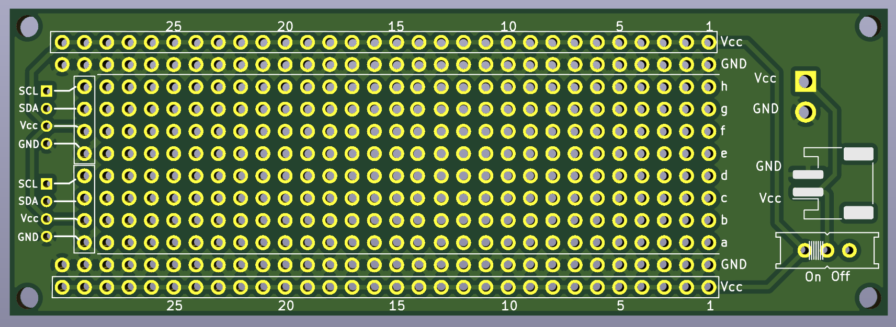
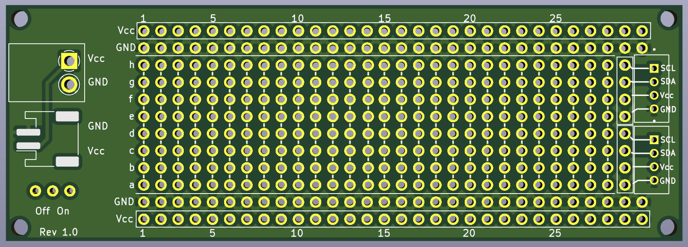
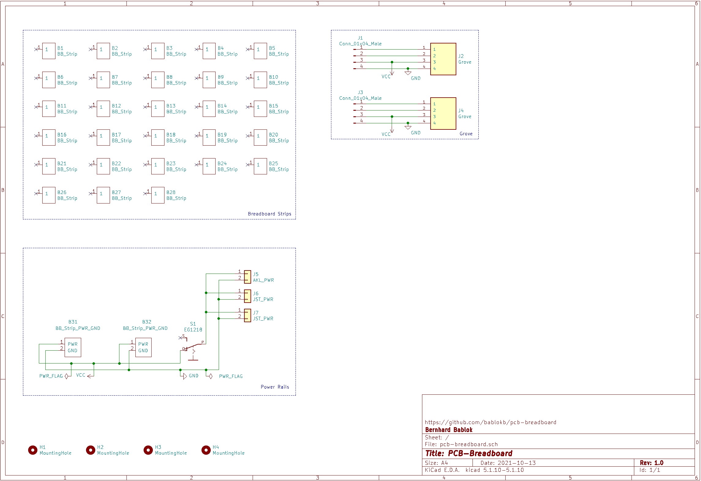
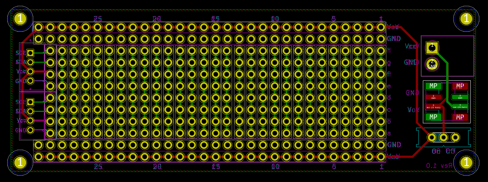

Project pcb-breadboard
======================

Overview
--------

This project contains the KiCAD files for a breadboard with

  - two (connected) power rails
  - power connectors (JST and barrel-jack)
  - on/off slider
  - two Grove connectors

In contrast to normal breadboards, the individual rails are not
paired, but the design allows to easily cut the rails on the back.

The schematic:

The layout:

Production Files
----------------

The production files are in `gerber.zip`.

License
-------

Shield: [![CC BY-SA 4.0][cc-by-sa-shield]][cc-by-sa]

This work is licensed under a
[Creative Commons Attribution-ShareAlike 4.0 International
License][cc-by-sa].

[![CC BY-SA 4.0][cc-by-sa-image]][cc-by-sa]

[cc-by-sa]: http://creativecommons.org/licenses/by-sa/4.0/
[cc-by-sa-image]: https://licensebuttons.net/l/by-sa/4.0/88x31.png
[cc-by-sa-shield]:
https://img.shields.io/badge/License-CC%20BY--SA%204.0-lightgrey.svg
